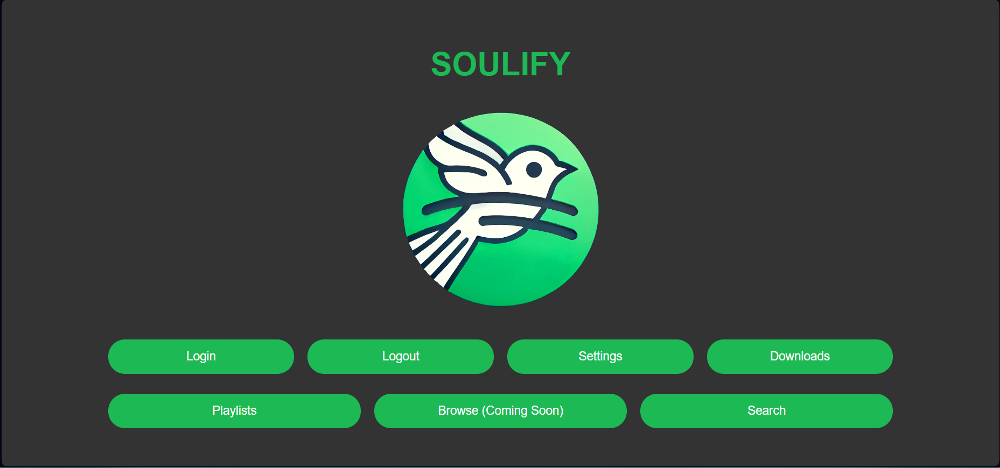
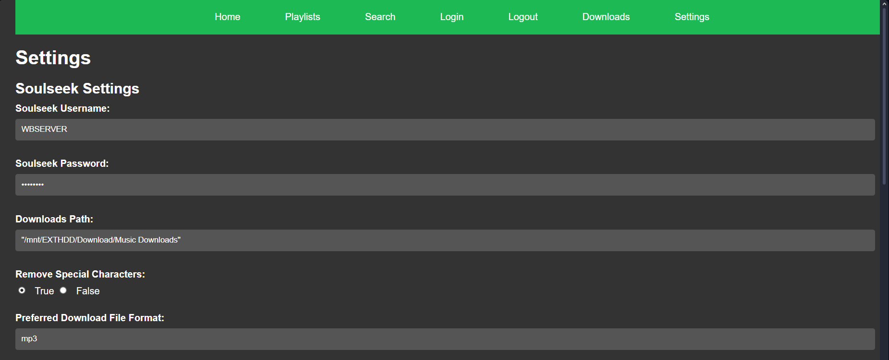
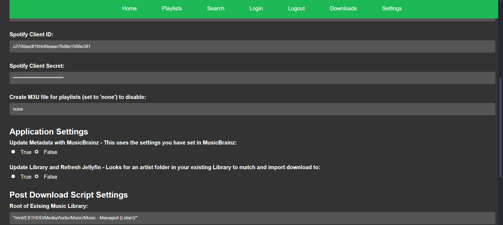
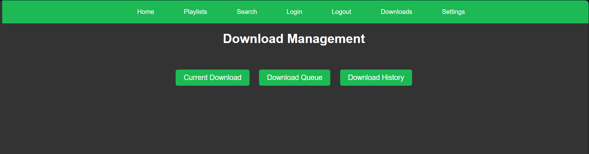
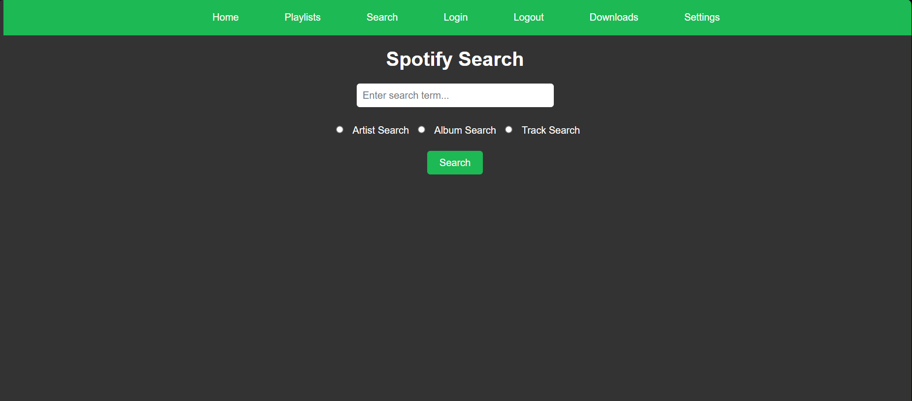
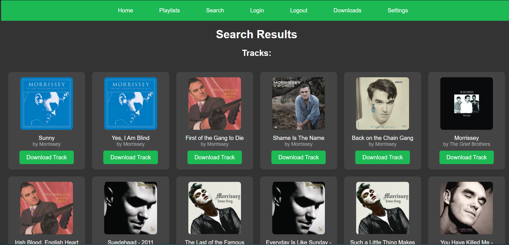
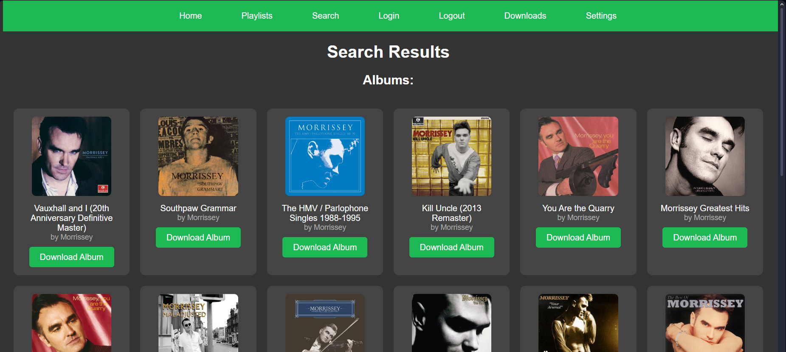
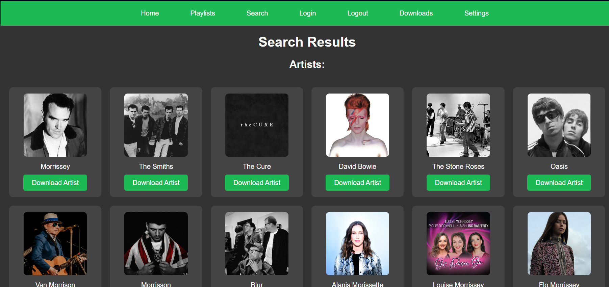
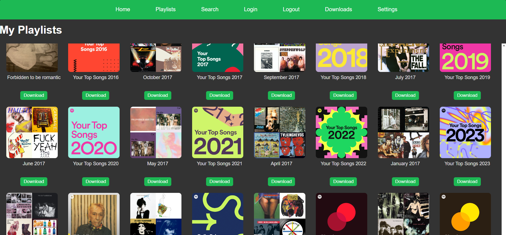
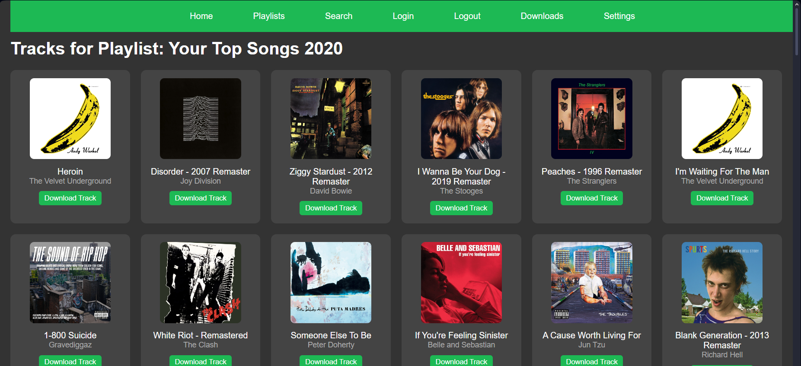

# Soulify


## Overview

Soulify is a hybrid web application that bridges the gap between Spotify and Soulseek, allowing users to search for and download their favorite tracks directly from the Soulseek network.

---

## Features

- **Spotify Integration**: Search for tracks, albums, and playlists directly from Spotify.
- **Soulseek Integration**: Download tracks and albums from Soulseek based on your Spotify searches.
- **Queue Downloads**: Manage multiple downloads with the built-in queueing system.
- **Post-Download Processing**: Automate metadata updates and organize your music library.

---

## Screenshots

### Home Page


### Settings Page




### Download Management


### Search Page


### Track Search Results


### Album Search Results


### Artist Search Results


### Download Entire Playlists


### Download Individual Playlist Tracks


---

## Requirements

- Spotify Premium account with developer access
- Linux machine for hosting your music files
- Python 3.6+

## Directory Structure

Create the following folders in your downloads directory:
- `Music Sorting` - For processed music awaiting final placement
- `Music New Artists` - For new artists not yet in your library
- `Music Downloads` - Where Soulseek downloads are initially stored
- `Music Unknown Album` - For albums that can't be automatically categorized

## Installation

1. Clone the repository:
    ```bash
    git clone https://github.com/WB2024/soulify.git
    ```
   
2. Navigate to the project directory:
    ```bash
    cd soulify
    ```

3. Install dependencies:
    ```bash
    pip install -r requirements.txt
    ```

4. Spotify Developer Setup:
    - Go to [Spotify Developer Dashboard](https://developer.spotify.com/dashboard/)
    - Create a new app
    - Set the redirect URI to `http://[your-local-ip]:5000/callback`
    - Note your client ID and secret for configuration

5. Create and configure the necessary configuration files:

    ### a. pdscript.conf
    ```
    destination_root=/path/to/your/music/library
    source_route=/path/to/your/Music Sorting
    new_artists_dir=/path/to/your/Music New Artists/
    Music_Download_Folder=/path/to/your/Music Downloads
    unknown_albums_dir=/path/to/your/Music Unknown Album
    ```

    ### b. sldl.conf
    ```
    # Soulseek credentials
    username=your_soulseek_username
    password=your_soulseek_password
    
    # General download settings
    download_directory=/path/to/your/Music Downloads
    
    retain_special_characters=false
    preferred_file_format=flac
    
    # Spotify settings
    spotify-id=your_spotify_client_id
    spotify-secret=your_spotify_client_secret
    ```

    ### c. SoulifyURL.conf
    ```
    [Server]
    base_url=http://your-local-ip:5000
    ```

    ### d. soulify.conf
    ```
    update_metadata=true
    jellyfin_refresh=true
    
    # Paths
    new_artists_dir=/path/to/your/Music New Artists/
    unknown_albums_dir=/path/to/your/Music Unknown Album
    ```

    ### e. spotifyauth.conf
    ```
    spotify_client_id=your_spotify_client_id
    spotify_client_secret=your_spotify_client_secret
    redirect_uri=http://your-local-ip:5000/callback
    ```

6. Run the application:
    ```bash
    python SpotWebApp.py
    ```

7. Open the displayed URL in your browser and login with your Spotify account.

---

## Usage

### Playlists
- Navigate to the **Playlists** section to view all your Spotify playlists
- Click **Queue Download** to add the entire playlist to your download queue
- Click on a playlist to view and select individual tracks for download

### Browse
- Click **Browse** to see generated playlists based on your Spotify account preferences
- Add these playlists to your download queue as needed

### Search
1. Click **Search** and choose to search for an artist, album, or track
2. Enter your search term and click search
3. For artist searches:
   - Click **Queue Artist Download** to download the entire discography
   - Click the artist name to view their discography broken down by album type
4. For album views:
   - Click **Queue Album Download** to download the whole album
   - Click the album name to see track listings by disc
   - Download specific tracks if desired

### Downloads Management
1. Click **Downloads** from the navigation bar or homepage
2. View your queued and running downloads
3. Click **View Console** to start downloading
4. In the interactive download console:
   - Click **Accept** for the best matched download
   - Use up/down buttons to browse other users' shares
   - Choose download options (specific files, entire folder, etc.)
5. The download will automatically terminate when finished and start the next queued item

### Post-Download Management
After downloading, the post-download scripts will:
1. Run Picard to correct metadata (if configured)
2. Move files to your sorting folder
3. Scan your library for matching artist folders
4. Move cleaned and renamed files to your library

---

## MusicBrainz Picard Integration (Optional but Recommended)

For the best metadata management, we recommend using MusicBrainz Picard with Soulify:

1. Create a Docker container for Picard with this compose file:
   ```yaml
   services:
     picard:
       image: mikenye/picard:latest
       container_name: picard
       volumes:
         - /path/to/your/storage:/data
         - /path/to/your/storage/DockerAppData/Picard:/config
       ports:
         - "5800:5800"
       restart: unless-stopped
   ```

2. Picard Configuration:
   - Set the `Music Downloads` directory as your starting directory
   - In options, set the destination directory as the `Music Sorting` folder
   - Enable "Move additional files" and include `*.jpg, *.png` for cover art
   - Ensure "Rename files when saving" is checked
   - Edit file naming script with the following or adjust as you like:
     ```
     $if(%albumartist%, %albumartist%, Unknown )/[$upper($if(%releasetype%,%releasetype%,ALBUM))] [$if(%originalyear%,%originalyear%)] %album%/[$upper($if(%media%,%media%,DIGITAL MEDIA))] [$upper($if(%releasecountry%,%releasecountry%,WW))] [$if(%date%,%originalyear%)]/
     $title($if(%media%,%media%,DIGITAL MEDIA)) $pad(%discnumber%,2,0)/
     %albumartist% - %album% - $pad(%tracknumber%,2,0) . %title%
     ```

# File Structure Example

    Y:\Media\Audio\Music\Sources\All\Rock - Goth\Joy Division\[ALBUM] [1980] Closer\[CD] [US] [2007]\CD 01\Joy Division - Closer - 02 . Isolation.mp3
    
    Y:\Media\Audio\Music\Sources\All\Rock - Goth\Joy Division\[ALBUM] [1980] Closer\[12_ Vinyl] [IT]\12_ Vinyl 01\Joy Division - Closer - 02 . Isolation.flac
    
    Y:\Media\Audio\Music\Sources\All\Rock - Goth\Joy Division\[SINGLE] [1980] Atmosphere\[12_ Vinyl] [GB] [1980]\12_ Vinyl 01\Joy Division - Atmosphere - 02 . She's Lost Control.mp3
    
    Y:\Media\Audio\Music\Sources\All\Rap & Hip Hop\The Notorious B.I.G\[EP] [0001] Demo Tape (92-93)\[Unknown] [WW] []\Unknown 01\The Notorious B.I.G. - Demo Tape (92-93) - 01 . Unsigned Hype Demo Tape.mp3